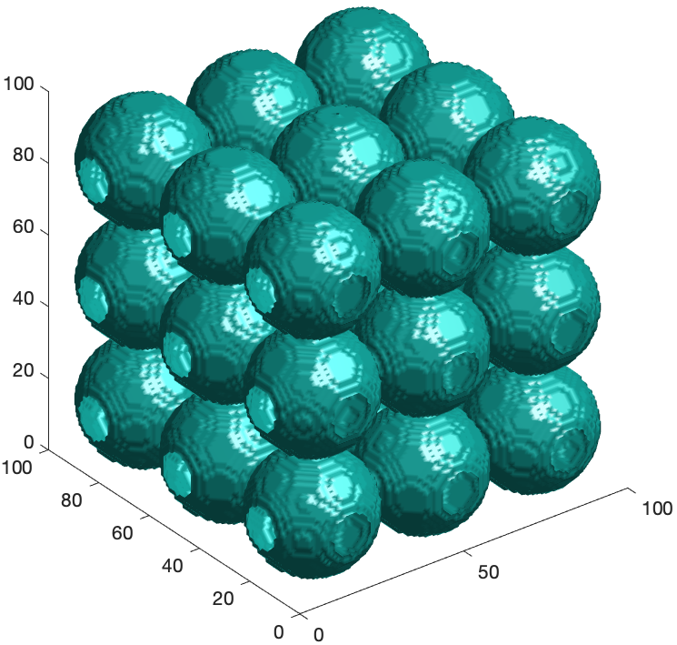
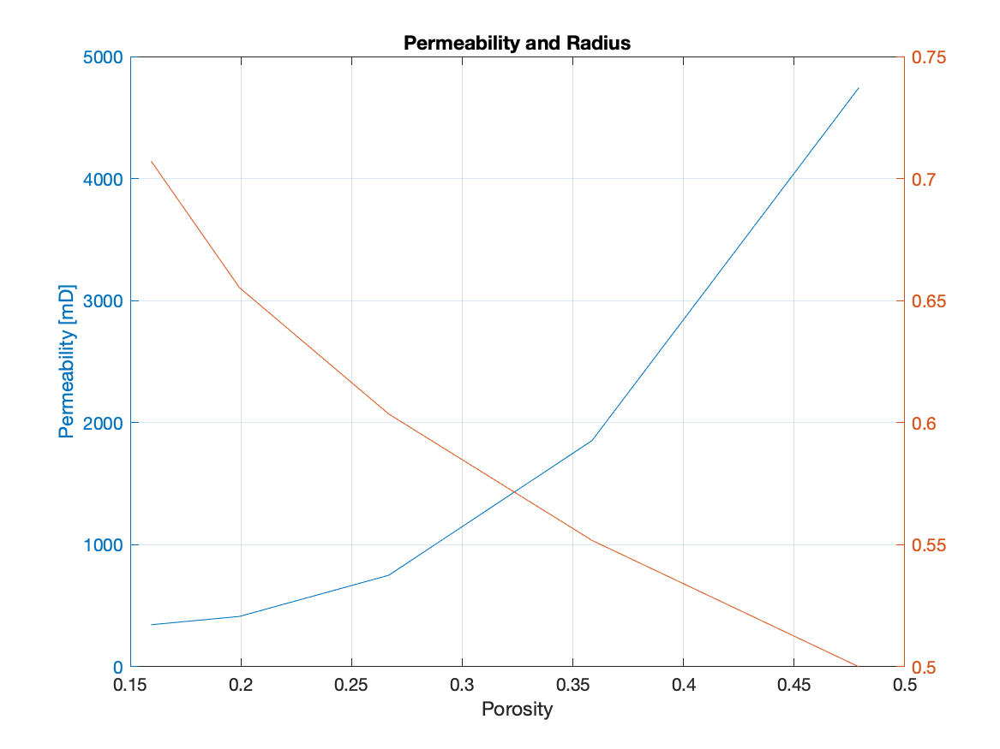
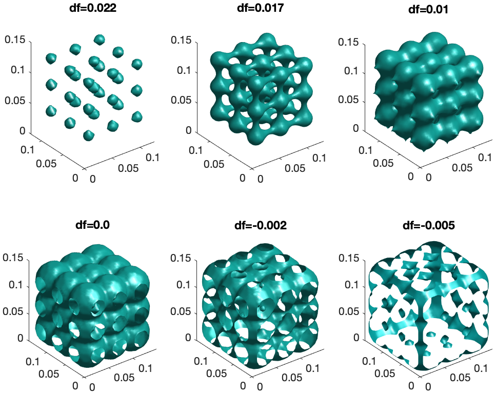

Dynamic Digital Rock Physics Class
======
GEOPHYS 203: Fluids and Flow in the Earth: Computational Methods
------
By Juan Pablo Daza
## Changing a Sphere Pack
Files needed:
* Binarized Sphere
* Lattice Boltzmann
 * filename
 * matlab Wrapper
* UNIX Mac/Linux
 * files LB Keehm and makefile

### Creating the Sphere pack
Open a new matlab script. Define sample resolution and radius of the spheres:
```
clear  % To prevent errors
N=50; % Resolution of sample
radius=0.5; % Adimensional size of radius
```
Create the sphere pack, note that this is the **ideal** pack without considering resolution, for now a pack of 1 sphere:
```
xs=[1:1:1];ys=xs;zs=xs;
[xg,yg,zg]=meshgrid(xs,ys,zs);
rs=radius*ones(size(xg(:)));
```
Convert sphere pack to a discrete grid, compute size of voxel and define the location of each voxel, **getBinarySpheres** is a function similar to the one you wrote in HW2, it converts location and size of spheres to discrete data that we can use in numerical computation, the script does not crop the sample:
```
testRock=getBinarySpheres(xg(:),yg(:),zg(:),rs,N);
Dgrain=0.05; % Diameter of the grain
dx=Dgrain*length(xs)/N;% Voxel Size [mm]
x=linspace(dx/2,N*dx-dx/2,N);
y=x;z=x;
[X,Y,Z]=meshgrid(x,y,z);
```
Here is a quick approximation to the average grain size of different granular materials:

|Size class      |Diameter [mm]|
|----------------|-------------|
|Fine gravel     |4.0          |
|Very coarse sand|2.0          |
|Coarse sand     |1.0          |
|Medium sand     |0.5          |
|Fine sand       |0.0625       |
|Coarse silt     |0.031        |
|Fine silt       |0.0039       |
|Fine clay       |0.00006      |

Now plot the spheres:
```
figure()
isosurface(X,Y,Z,testRock,0.5);
daspect([1 1 1])
view(3);
```
To increase the number of spheres in the pack change the line:
```
xs=[1:1:1];ys=xs;zs=xs;
```
For instance to:
```
xs=[1:1:5];ys=xs;zs=xs;
```
For a pack of 5x5x5. What we get for a pack of 3x3x3 is:


### Computing properties on the sphere Pack
Here we use Lattice Boltzmann to compute permeability:
Windows:
```
perm=perm3d(testRock,dx);
```
Mac/Linux:
```
perm=perm3dFilename(testRock,dx,'spherePack');
```
Now we change the radius en see the changes in permeability, explore the range:
```
radii=linspace(0.5,sqrt(2)/2,5);
```
We get the following results:




## Distance Function, a tool from the Level Set Method
We explored a way to evolve the geometry. However that way is a bit artificial and constrained. Now we will use the distance function which is a more general way to modify the geometry of the rock.

Here we will use the same code as before, but will add a line to create an implicit function, which in this case is the distance function.

```
df=-implicitFuncFromBinary(testRock,dx);
```
We will now compute the properties on the different levels of the distance function for our sphere pack.

```
figure()
lev=0.017;
isosurface(X,Y,Z,df,lev)
daspect([1,1,1])
view(3)
```



Now we can compute permeability on the different levels as follows:
```
lev=0.017;
perm=perm3dFilename(df>lev,dx,'spherePack');
```


